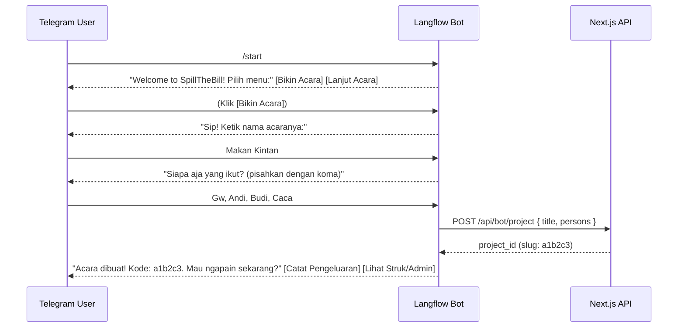

# Rencana Implementasi: Telegram Bot (Langflow) 🤝 SpillTheBill

Berdasarkan diskusi mendalam kita, rancangan bot ini dinaikkan levelnya dengan memanfaatkan fitur-fitur native Telegram (UI Button) dan logika backend yang lebih pintar untuk menangani bahasa sehari-hari ("buat semua", "kecuali", dll).

## 1. Flow Interaktif (Memanfaatkan Telegram Inline Buttons)

Kita tidak akan memaksa user mengetik command seperti `/new` atau `/join` secara manual. Kita akan merancang bot untuk mengirim **Inline Keyboard Buttons** di Telegram.



## 2. Sinkronisasi dengan Flow Website (Nama & Peserta)

Sama seperti di website, setelah user klik **[Bikin Acara]**, bot akan menanyakan:
1. **Nama Acara**
2. **Daftar Peserta Awal** (contoh: "Gw, Budi, Caca")

**Bagaimana kalau nanti ada typo atau nama baru saat catat pengeluaran?**
*   **Typo:** Langflow (LLM) cukup pintar untuk tahu kalau user ngetik "ndi", maksudnya adalah "Andi". LLM akan menormalkan output JSON-nya.
*   **Nama Baru (Security):** Jika LLM mendeteksi nama yang benar-benar baru (misal: "Joko") dan mengirimkannya ke API Next.js kita, API kita akan **otomatis membuatkan profil Joko (Upsert)** di acara tersebut. Ini meminimalisir error dan tidak memblokir user saat lagi asik mencatat.

## 3. Logika "Dibebankan ke Semua" & "Kecuali"

Untuk *use case* di mana user bilang:
*   *"Sate 150rb dibayar andi buat semua"*
*   *"Sate 150rb dibayar andi buat semua kecuali gw"*

Karena Langflow (LLM) mungkin tidak tahu daftar lengkap peserta secara *real-time*, kita akan mendesain *Prompt* LLM untuk memuntahkan "Special Keyword" yang nantinya akan diproses dengan pintar oleh Backend (Next.js) kita:

**Spesifikasi Output JSON dari Langflow:**
```json
{
  "project_slug": "a1b2c3",
  "item_name": "Sate Ayam",
  "price": 150000,
  "payer_name": "Andi",
  "participant_names": ["ALL"] // <-- Keyword khusus jika user bilang "semua"
  // ATAU JIKA ADA PENGECUALIAN:
  // "participant_names": ["ALL_EXCEPT", "gw"]
}
```

**Tugas Next.js API (`POST /api/bot/expense`):**
Ketika API menerima keyword `["ALL"]`, API akan melakukan *query* ke database: *"Ambil semua Person_ID yang ada di acara ini, lalu masukkan mereka sebagai peserta sate ayam."*
Jika menerima `["ALL_EXCEPT", "gw"]`, API mengambil semua *Person_ID*, lalu memfilter nama "gw" sebelum melakukan *insert*.

---

## 4. Rangkuman Tugas (Division of Labor)

### Tugas Saya (Koding di Next.js):
1. **Membuat `POST /api/bot/project`**: Menerima nama acara & daftar peserta awal -> Mengembalikan `slug` dan Link Admin.
2. **Membuat `POST /api/bot/expense`**: Menerima JSON pengeluaran dari Langflow -> Memproses logika `ALL` / `ALL_EXCEPT` / Typo -> Insert ke Supabase.

### Tugas Kamu (Setup di Langflow):
1. **Bikin Telegram Bot Component** di Langflow.
2. Bikin logika **Inline Buttons** dan flow tanya-jawab berantai (Memory/State).
3. Set up **Prompt LLM** untuk ekstraksi JSON dengan aturan *special keyword* di atas.
4. Set up **API Request / Webhook node** untuk menembak ke URL Next.js kita.

## User Review Required

Konsep ini sudah sangat matang dan menyelesaikan masalah *edge-case* (peserta, *button*, kata "semua").

Jika kamu sudah puas dengan spesifikasi interaksi antara Langflow dan Next.js ini, silakan klik **Proceed**. Saya akan langsung mulai mengimplementasikan file `route.ts` untuk kedua Endpoint API di backend kita!
